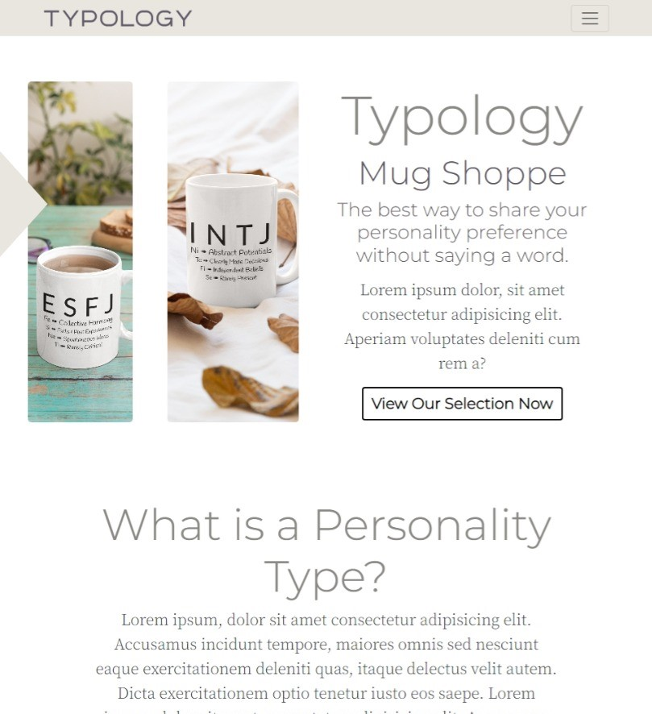

## Typology Mug Shoppe

A React application for a specialty mug shoppe. Built with React, Redux toolkit, JavaScript, and CSS.

## Project Screen Shots

Home Page Jumbotron

The home page displays a jumbotron with introductory information.

Responsive Web Design

The layout adjusts based on screen size.

Responsive Design on Mobile Sized Screens

The responsive design responds also to mobile-sized screens.

Photo Grids and Various Design Patterns are Present Throughout

The project utilizes a variety of layouts.

Products Page

The project utilizes a variety of layouts.

Products Page Filtering

Products can be filtered by personality and cup type. They can also be sorted by name or price.

Single Product Page

The individual product page features multiple photos of the cups, information, and the ability to add the cup to the cart.

Add to Cart Modal

Clicking on 'Add to Cart' on the individual product page will launch a modal. This is just one of the modals in the project.

Cart Page

The cart page allows the user to change the quantity of, or remove, items previously added to the cart..

**There are several other pages to this project. Please see below for instructions on how to setup the project to view more.

## Installation and Setup Instructions

Clone this repository. You will need `yarn` installed on your machine.  

Installation:

`yarn install`   

To Start Server:

`yarn start`  

To Visit App (assuming you have no other application running on port 3000):

`localhost:3000/`  

## Reflection

This project was built primarily while I was studying in the Nucamp Full Stack Web and Mobile Application Development Bootcamp, during the React course. The project goals included using React, CSS, JavaScript, and Redux Toolkit in order to familiarize myself with these technologies. 

After the creation of the L.A. Bus Tours website, I decided to make something more dynamic. This application supports viewing a list of products which can be filtered on the basis of cup and personality type. It also supports sorting on the basis of price or name. There is a cart feature that allows quantity additions and deletions.

I ran into several challenges while implementing this project. One of the challenges was setting up Redux for the products sorting/filtering and the cart functionality. It was a unique challenge as it involved moving the brains of the operation, in comparison to the structure of simple JavaScript web applications, which I had already been accustomed to creating. Another issue I ran into that took some time to resolve involved incompatibilities of the transition package I was attempting to use with React Router Dom 6. After over a day of research I was able to settle on a working alternative, as the transition effect was not a component I wanted to leave out.

The technologies implemented in this project include React, React Router Dom 6, Redux with Toolkit, Bootstrap, Reactstrap, Framer Motion,  VanillaJS, JSX, CSS and more.

# Note

This project was bootstrapped with [Create React App](https://github.com/facebook/create-react-app).
